# News Explorer App

## Introducere si definirea problemei
News Explorer este o aplicație dezvoltată pentru a oferi utilizatorilor o experiență centralizată, personalizată și eficientă de explorare a știrilor. Într-un context marcat de dezinformare sau chiar suprainformare, și surse de credibilitate variabilă, aplicația permite filtrarea pe categorii, salvarea articolelor și accesul rapid la informații relevante din surse multiple. Creată în principal pentru utilizatorii din SUA, dar utilă și la nivel internațional, aplicatia contribuie la combaterea dezinformării și la simplificarea consumului de conținut informativ.

## Descrierea tehnologiilor cloud folosite 
Aplicația News Explorer utilizează mai multe servicii cloud prin intermediul API-urilor pentru a oferi funcționalități esențiale:

1. NewsAPI – Serviciu RESTful care furnizează știri în timp real din surse de încredere. A fost folosit endpointul /v2/top-headlines cu parametrii country=us și category, pentru a filtra știrile pe teme precum business, sport sau tehnologie. NewsAPI oferă un plan gratuit util pentru dezvoltare.(Developer plan)

2. MongoDB Atlas – Bază de date NoSQL în cloud folosită pentru stocarea știrilor salvate de utilizator. Asigură gestionarea rapidă și sigură a operațiunilor CRUD asupra datelor personale.

3. Google OAuth 2.0 + NextAuth.js – Autentificarea se realizează prin Google, folosind o rută dedicată (/api/auth/[...nextauth]) care orchestrează procesul de login, logout și gestionare a sesiunii. Tokenurile și datele de autentificare sunt stocate în MongoDB cu ajutorul MongoDB Adapter, oferind un sistem sigur și scalabil.

## Descrierea tehnologiilor de dezvoltare folosite
    Front-end:
- **Next.js** – Framework React modern, cu suport pentru Server-Side Rendering (SSR) și Static Site Generation (SSG), ideal pentru aplicații rapide și scalabile.
- **Tailwind CSS** – Framework CSS utilitar folosit pentru stilizare rapidă, responsive și personalizabilă, fără a scrie fișiere CSS separate.

    Back-end:
- **API Routes (Next.js)** – Utilizate pentru a crea endpointuri REST care interacționează cu NewsAPI și cu baza de date MongoDB, gestionând preluarea, procesarea și salvarea știrilor.
- **NextAuth.js + Google OAuth 2.0** – Sistem de autentificare sigur și flexibil, integrat direct în aplicație.

    Versionare și Deploy:
- **Git**  – Sistem distribuit de versionare pentru gestionarea codului și colaborare eficientă.
- **Vercel** – Platformă cloud optimizată pentru aplicații Next.js, utilizată pentru deploy automat, scalare dinamică și performanță ridicată în producție.

## Flux de date 
### Metode HTTP și exemple de request/response
    Metode HTTP folosite in aplicatie sunt:
- **GET** — pentru a obține știrile cu informațiile aferente din API-ul extern NewsAPI.
- **POST** — pentru a salva un articol în baza de date MongoDB, pentru utilizatorul
autentificat.
- **GET** — pentru a prelua articolele salvate din MongoDB și a le afișa în lista personală
a utilizatorului.
- **DELETE** — pentru a șterge un articol salvat din baza de date.

### Exemple de request/response 
1. Request si response  GET stiri – pentru parametrul contry=us si category= business 
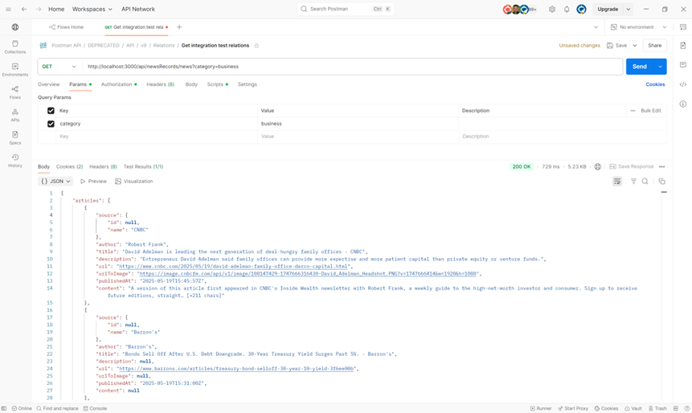
2. Request si response GET stiri – pentru parametrul contry=us si category= business – apel backend cu paginare
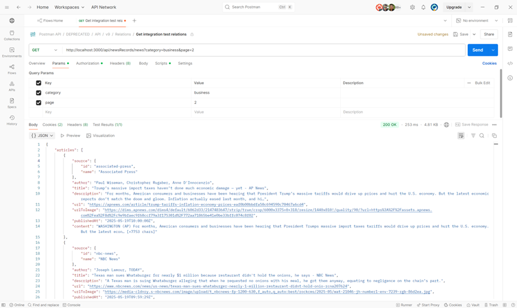
3. Request si response  POST – salvare articol pentru utilizatrul autentificat
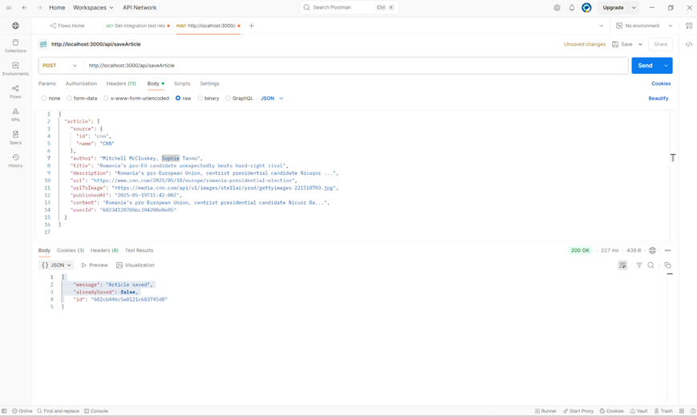
4. Request si response GET – preluare articole salvate de utilizatorul autentificat
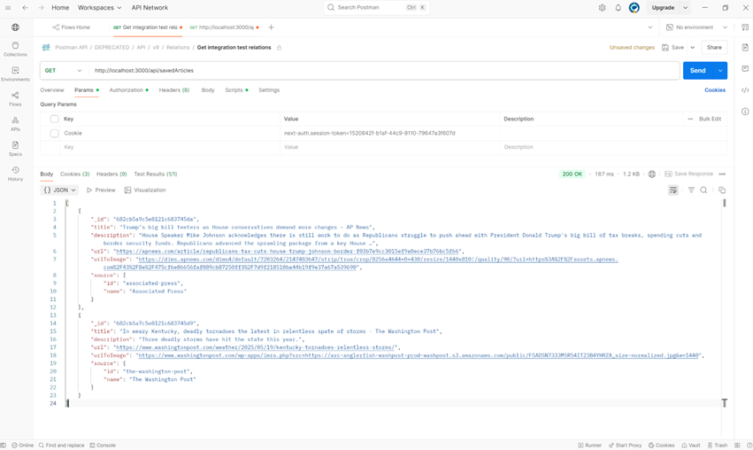
5. Request si response DELETE – stergere articol din lista personala a utilizatorului autentificat
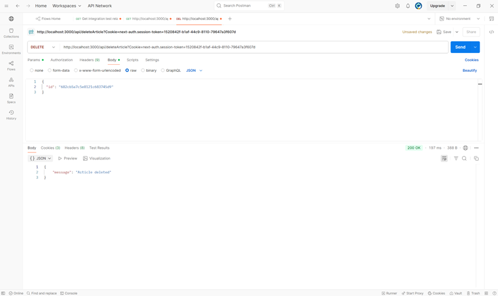

### Autentificare si autorizare servicii
Cele mai importante trei API-uri care au fost integrate în cadrul aplicației NewsExplorer necesită autentificare cu ajutorul unor API key-uri furnizate de serviciile respective, care se pot obține doar după ce utilizatorul își creează un cont pentru fiecare.

1. Pentru a utiliza Google OAuth 2.0, a fost necesară autentificarea în Google Cloud Platform, unde resursele gratuite sunt limitate. După crearea contului, am primit un credit de 300 de dolari și am fost informată că orice depășire a acestei sume va fi taxată suplimentar.Datele primite – Client ID și Client Secret – au fost adăugate în fișierul .env.local, pentru a fi utilizate în configurația NextAuth.

2. Utilizarea API-ului pentru MongoDB este gratis dacă a fost ales pachetul free.

3. Serviciul NewsAPI necesita, la fel ca celelalte API-uri folosite, obtinerea API key-ului. Acesta se poate obține gratuit, însă este necesar să îți creezi un cont pe site-ul oficial. NewsAPI impune o limită de request-uri în planul gratuit(Developer), fiind permis un număr restricționat de cereri pe zi (100 cereri/zi în planul de bază).

## Capturi de ecran din aplicatie 
Mai jos se regasesc capturi de ecran din versiunea live, găzduită pe Vercel.

Pagina principala
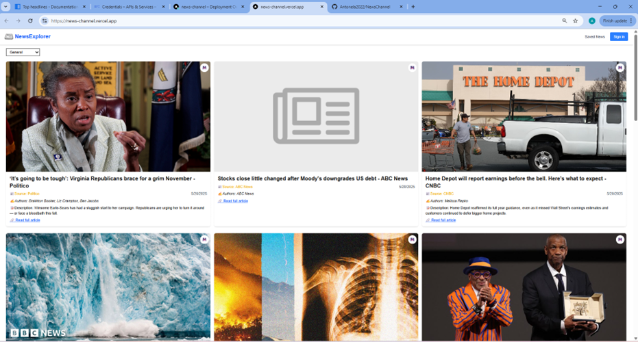

Pagina principala si filtru
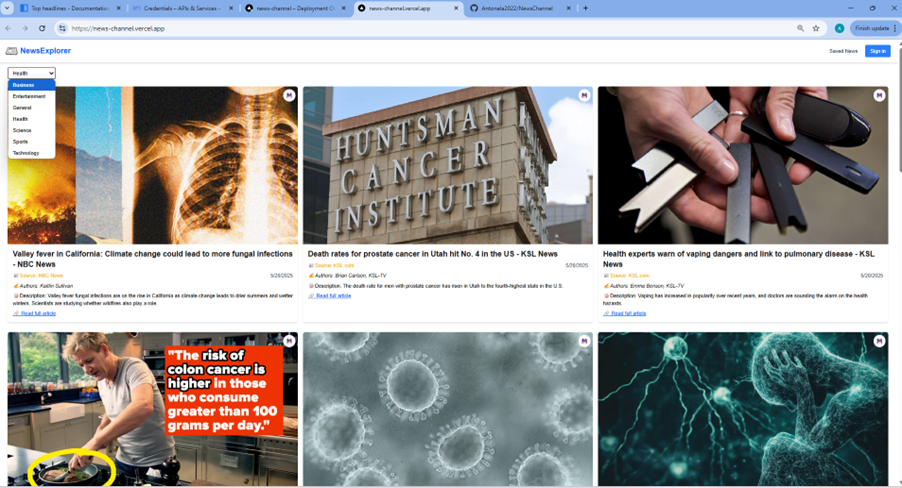

La apasarea iconitei de salvare daca utilizatorul nu este autentificat

La apasarea tab-ului Saved News daca utiliztorul nu este autentificat 
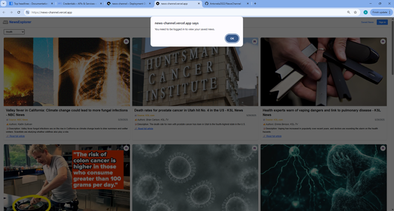

Autentificare realizata cu succes cu google 

Articol salvat cu succes 
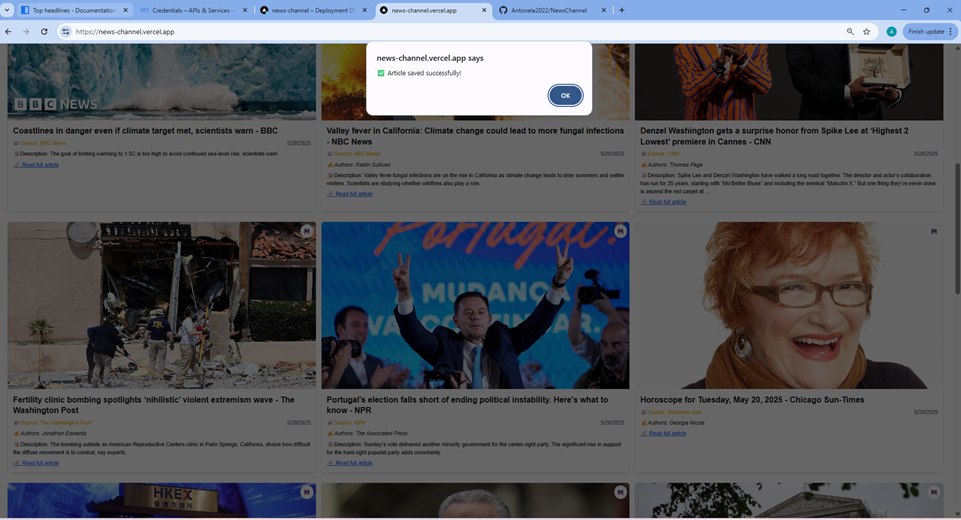

Salvare articol de mai multe ori:
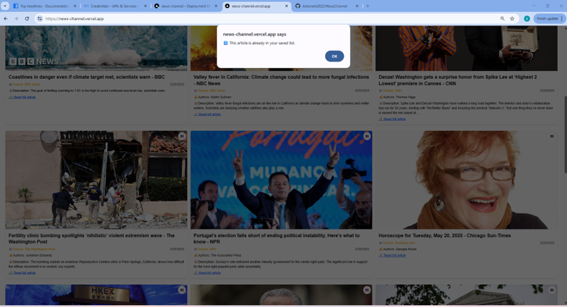

Pagina Saved News - lista personala a stirilor salvate 
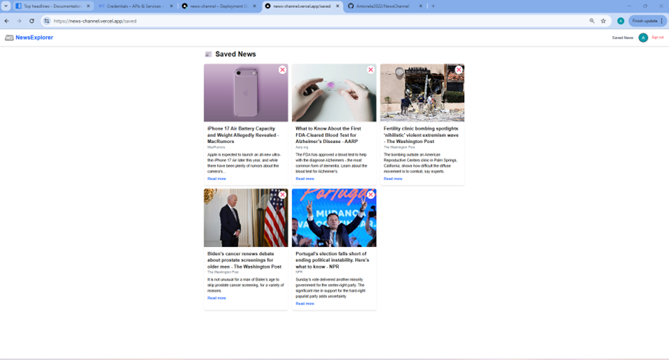

Rezultat articole sterse:
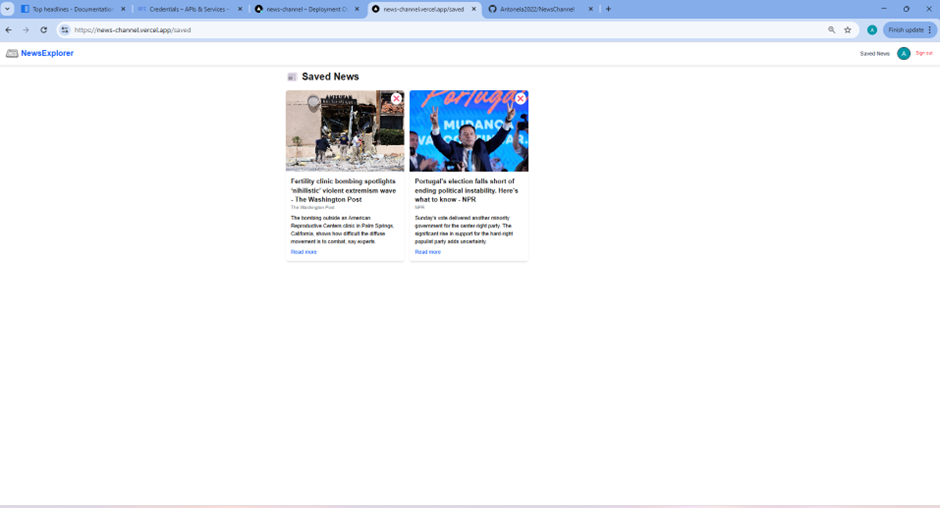
First, run the development server:

Pentru deconectare se poate apasa butonul Sign-out din cadrul antetului
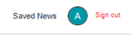
